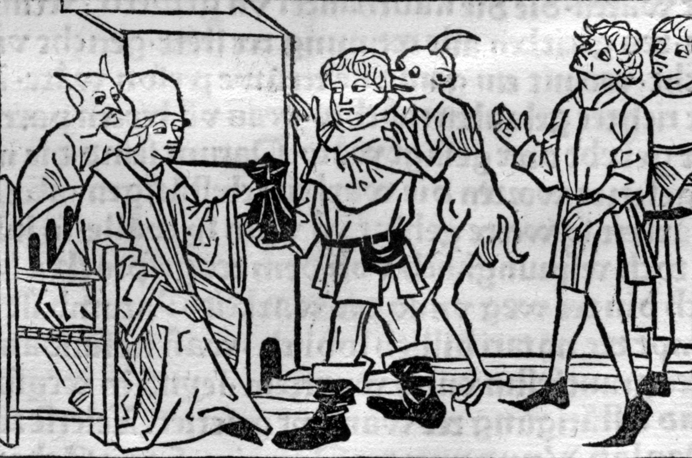

# Statuta

Un esperimento per la raccolta di testi statutari.

Il notaio disonesto secondo _[Spiegel des menschlichen Lebens](https://www.loc.gov/resource/rbc0001.2014rosen0057/?sp=117&st=image)_, XV sec. (immagine di pubblico dominio)
